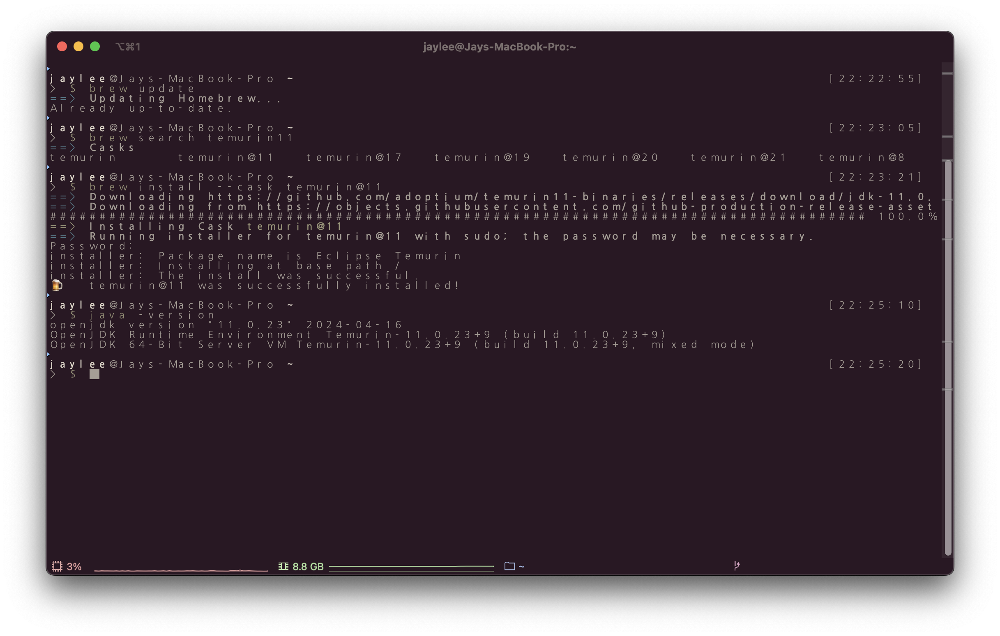
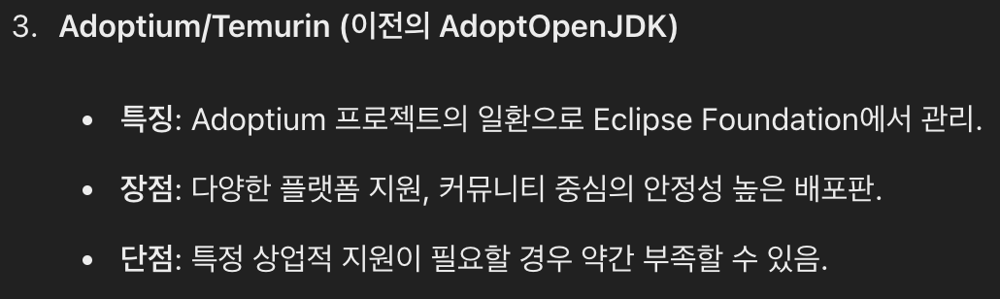
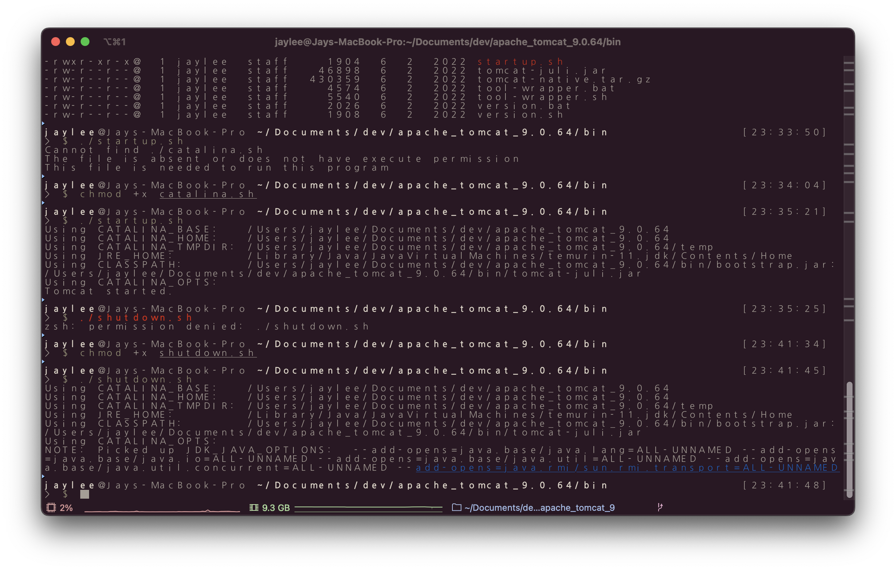

# 240624

수업 수강을 위해 개발 환경을 다시 구축 중이다. (기존 사용 중이던 laptop 용량 이슈로 새로 하나 구매...)

temurin JDK 11 을 사용한다고 하여 terminal, homebrew 를 이용해 설치했다.

<figure><figcaption>
더불어 iterm, zsh 를 통해 terminal 을 꾸며봤다.
</figcaption></figure>

전부터 궁금했던 건데 JDK 의 종류에는 뭐가 있고, 어떤 장단점과 특징들이 있으며, 애초에 JDK 가 무엇인지 궁금해서 찾아봤다.

여담으로 예전엔 검색은 구글링을 의미했는데 요새는 그냥 chatGPT 를 의미...

물론 얘가 거짓말을 하는지 안 하는지는 더블 체크를 하느라 구글링은 여전히 필수다.

<figure><figcaption>
그 외에도 수많은 JDK 들을 알려줬다.
</figcaption></figure>

* temurin JDK 의 경우 가장 널리 사용되는 HotSpot JVM 을 사용
* JDK 는 JVM 을 포함한 JRE 와 compiler, debugger 등을 포함하는 JDT 로 구성

IDE 는 JetBrain 사의  IntelliJ Ultimate 버전을 준비해왔다.

Apache Tomcat 의 경우 9.0.64 버전을 archive 로부터 준비했다.

<figure><figcaption>
수많은 permission denied
</figcaption></figure>

* tomcat 이란 servlet interface 의 구현체이며 servlet container 중 하나
* servlet container 는 servlet 의 life-cycle 을 관리

자연스럽게 servlet 이 무엇인가 궁금해졌다. 내일 아침에 찾아봐야지.
