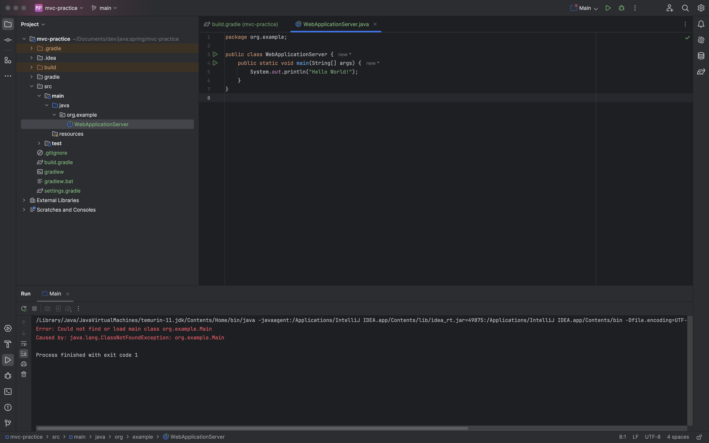
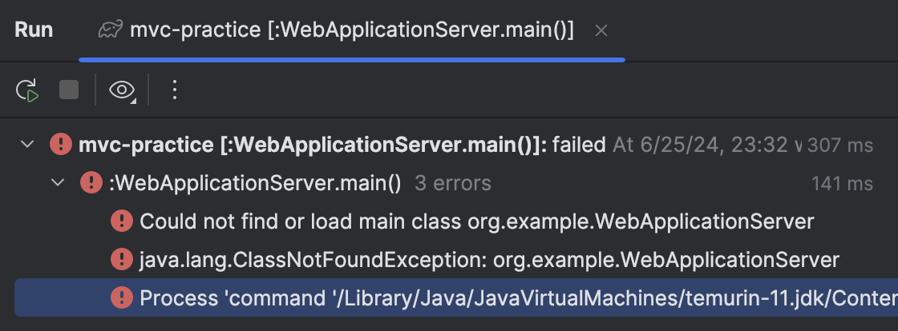

# 240625

<figure><figcaption></figcaption></figure>

* GET, POST 등의 HTTP 요청과 응답을 처리해주는 프로그램 모듈

***

<figure><figcaption></figcaption></figure>

<figure><figcaption>
시작부터 error 와 함께
</figcaption></figure>

왜 Hello, World! 를 띄우질 못 하니.

우선 자고 내일 다시 봐야겠다.
