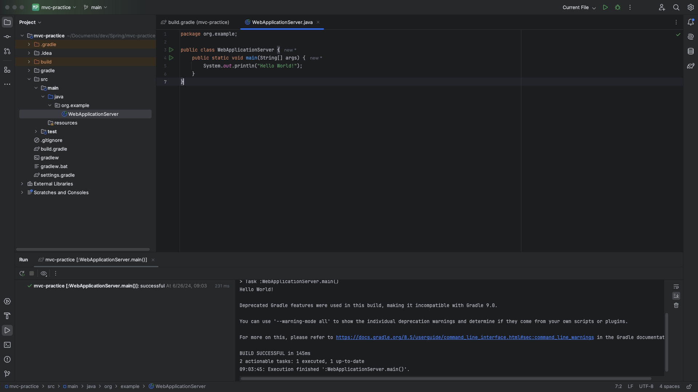
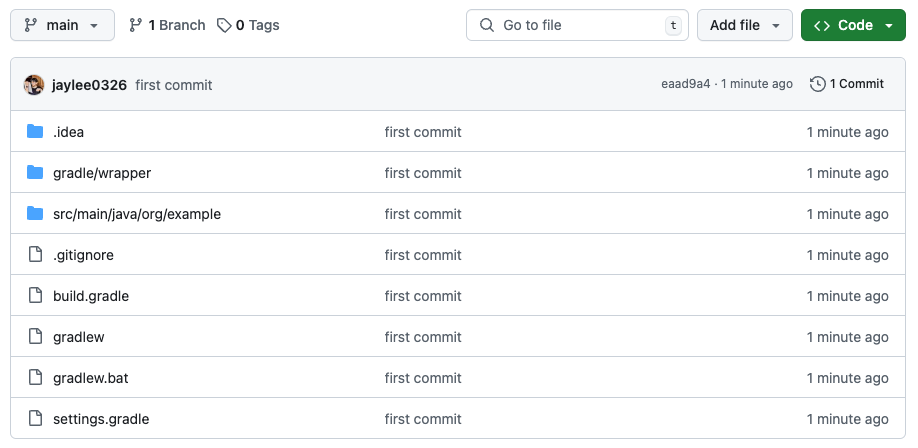
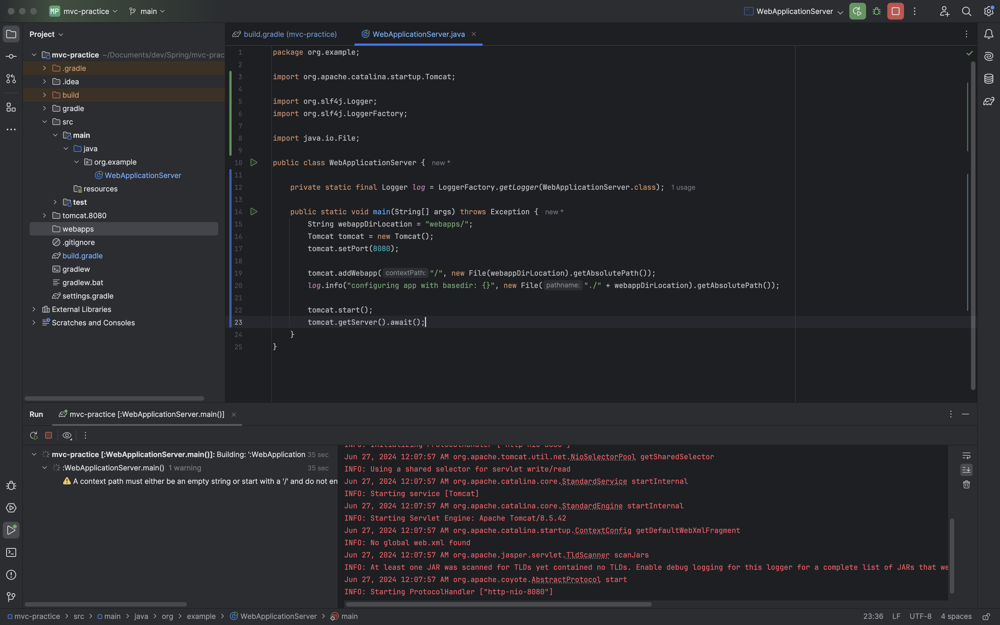

# 240626

<figure><figcaption></figcaption></figure>

프로젝트를 저장한 디렉토리 이름에 있는 특수문자 때문이었다.

~~멍청한 놈...~~

<figure><figcaption></figcaption></figure>

겸사겸사 잔디도 심고 가꿔나갈 겸 바로 git 도 만들어줬다.

부디 작심삼일이 되진 않길.

***

<figure><figcaption>
starting service [tomcat]
</figcaption></figure>

집에 오고 예시 코드 작성 후 실행하는데 또, 또, 또 에러...

webapp 추가 시에 사용되는 webapps 라는 디랙토리가 없어서 계속 발생하는 에러였다.

이거 고민하고 해결하느라 시간을 너무 많이 소비했다. 그래도 동작이 되는 건 확인했으니 내일 코드 해석이랑 나머지 부분들 공부해야겠다.

