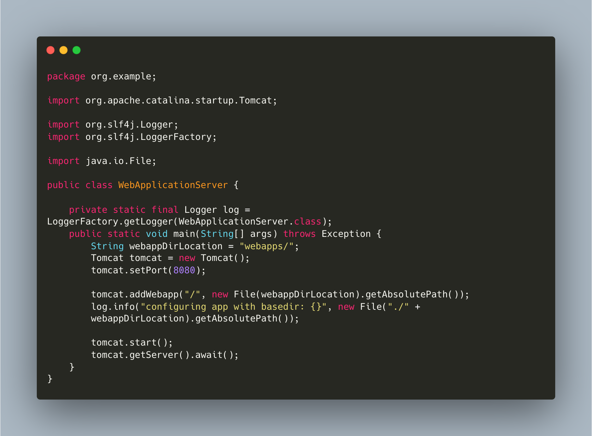

# 240628

어제는 운동하고 집에 돌아오니 너무 피곤해서 일어나 뭔가를 할 겨를이 없었다.

* webapps 라는 값을 webappDirLocation 라는 문자형 변수에 할당한다.
* tomcat 객체를 생성하고 포트를 8080 으로 설정
* root context (/) 에 webapps 디렉토리를 웹 애플리케이션으로 추가한다.
* log 로 웹앱의 기본 디렉토리 출력

<figure><figcaption></figcaption></figure>

***
