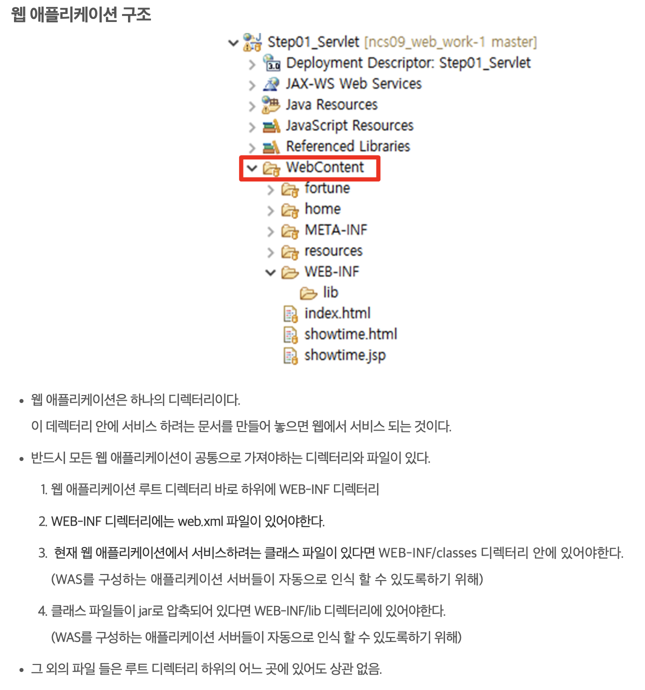

# 240629

tomcat 은 반드시 WEB-INF 라는 디렉토리에 포함된 class 만을 찾을 수 있다고 한다.

무슨 뜻인가 해서 찾아보니

<figure><figcaption>
https://sallykim5087.tistory.com/120
</figcaption></figure>

웹 어플리케이션의 구조와 관련이 있었다.

그 외에도 어떤 디렉토리에 있냐에 따라 접근 권한 같이 보안과 관련된 부분도 달라지는 것 같다. 자세한 건 한숨 좀 자고 찾아봐야겠다.

그나저나 내일 비 오는데 사무실 이사를... 🥲
