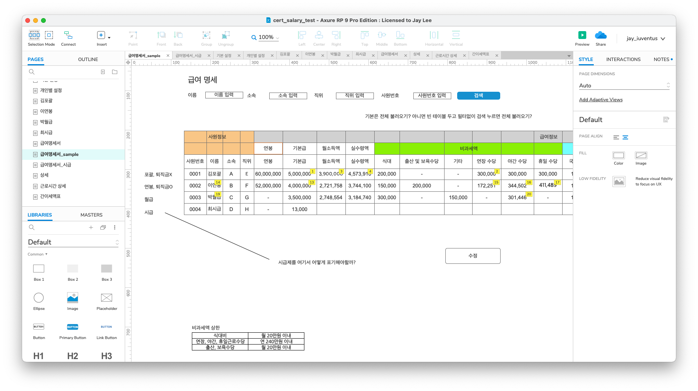

# ✏️ gibberish

GitBook 이 익숙하지도 않은데 merge 할 때마다 어제 작성한 첫 글이 자꾸 README 로 가버려서 따로 첫번째 글 작성해보는 중...

<figure><figcaption>
Axure 로 작성 중인 급여명세서 관련 페이지 설계
</figcaption></figure>

여담이지만 Axure 를 저렇게 쓸 거면 그냥 파워포인트를 쓰는 게 낫지 않을까 싶다.
